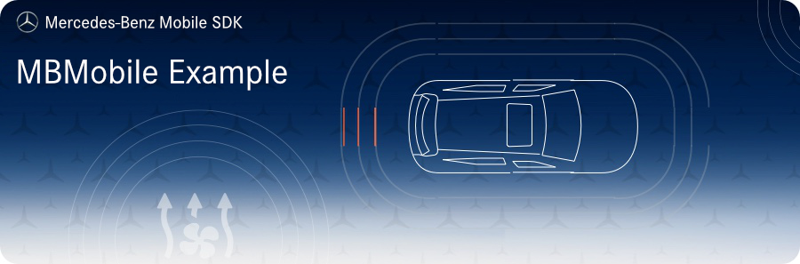

   

## Prerequisites

* Installed and configured development environment, namely [Xcode](https://developer.apple.com/xcode/).
* Installed Cocoa Pods for your Mac. See [Cocoa Pods](https://cocoapods.org/) for more information.
* An account in our [Mercedes-Benz /developers portal](https://developer.mercedes-benz.com/).
* A simulated vehicle. Login to our portal and open our [simulation environment](https://developer.mercedes-benz.com/car-simulator) within the same browser so that the authenticated user gets created on the simulator. This must only be done once!

## Intended Usage
### Step 1. Subscription

* Open the [Mercedes-Benz /developers portal](https://developer.mercedes-benz.com/sdks) and navigate to SDKS > IOS.
* Get your subscription for the SDK by clicking the "GET ACCESS" button on the top right of the overview page.
* For now, we suggest subscribing to the Standard Sandbox product.
* You will then find your OAuth credentials that you'll need in the next step in the CONSOLE area of our portal.

### Step 2. Get familiar with the sample app

* Clone the repository of our sample app via `git clone https://github.com/Daimler/MBSDK-Example-iOS.git`.
* Install the neccessary pods via `pod update`.
* Open the MBMobileExample.xcworkspace file.
* Open the `MBMobileSDKConfigurationHelper.swift` file within the `Helper` group and set your ClientID that you received with your OAuth credentials in the previous step as a parameter of the the configuration.
* Build and run the project.
* Login with the same email adress you are using for the portal and the simulation enviroment (see Step 1). You can enter any pin.

**Reminder:** The app is now communicating with a simulated vehicle. If you want to use the sample app with a real vehicle, a productive key is needed.

### Step 3. Start development

Check our next guide about [setting up the SDK](https://developer.mercedes-benz.com/sdks/ios/guides/setting_up_sdk).

## Code of Conduct

Please read our [Code of Conduct](https://github.com/Daimler/daimler-foss/blob/master/CODE_OF_CONDUCT.md) as it is our base for interaction.

## License

This project is licensed under the [MIT LICENSE](LICENSE).

## Provider Information

Please visit <https://mbition.io/en/home/index.html> for information on the provider.

Notice: Before you use the program in productive use, please take all necessary precautions,
e.g. testing and verifying the program with regard to your specific use.
The program was tested solely for our own use cases, which might differ from yours.
